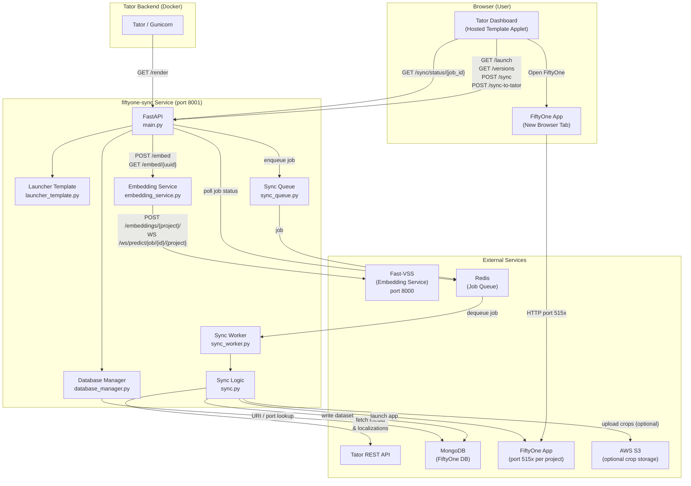

# FiftyOne Sync Service

Backend service to sync data between Tator and Voxel51 for quickly editing localizations
and downstream model iteration.

See https://docs.mbari.org/internal/ai/videos/voxel51demo.gif for demo of the community Voxel51 tool.

Supports both [Voxel51 Community](https://github.com/voxel51/fiftyone) and Voxel51 Enterprise sync.  Syncing is done by version through a simple applet.

### Applet for Tator dashboard to sync to Voxel51. When syncing is done, a clickable link is provided.

### Example Voxel51 embedding/grid view. Samples can be refined by lassoing an embedding cluster, or by filtering onmetadata (e.g. depth, label, confidence):

### Example Voxel51 similarity search view

### FastAPI


## Architecture



## Features

- **Embedding API**: Delegates to Fast-VSS (`http://localhost:8000/embeddings/{project}/`)
  - `POST /embed` - Submit images (multipart/form-data) + project, returns UUID
  - `GET /embed/{uuid}` - Poll for results (job status from Fast-VSS via WebSocket `/ws/predict/job/{job_id}/{project}`)
  - Set `FASTVSS_API_URL` env var to override Fast-VSS base URL

- **Port isolation**: One FiftyOne App instance per Tator project (one port per project)
  - Port = 5151 + (project_id - 1)

- **MongoDB isolation**: One MongoDB (`containers/fiftyone-sync`); per-project DB `fiftyone_project_{id}` (override via `FIFTYONE_DATABASE_NAME` or `database_name` query param on `/launch` and `/sync`).

- **Launcher** (HostedTemplate): `/render` (Open FiftyOne + Sync from Tator), `/launch`, `/sync` + `/sync/status/{job_id}`, `/recompute-crops` (+ status/logs), `/sync-to-tator`, `/versions`. Token entered in applet via **Verify Token**; FiftyOne opens in a new tab (`iframe_host` = app host).

- **Sync queue (Redis)**: Background worker: `python -m src.app.sync_worker`. Env: `REDIS_HOST`, `REDIS_PORT`, `REDIS_PASSWORD`, `REDIS_USE_SSL`, or `REDIS_URL`.

## Run (Docker)

The service is intended to be run via the compose stack, which starts MongoDB(community only) and the API:

```bash
# From repo root
docker compose -f containers/fiftyone-sync/compose.yaml up -d
```

API: http://localhost:8001. Optional env: copy `containers/fiftyone-sync/.env.example` to `containers/fiftyone-sync/.env` to set `FASTVSS_API_URL`, `REDIS_HOST`, etc.

## Development

For local iteration (no Docker for the API):

```bash
cd services/fiftyone-sync
export FIFTYONE_DATABASE_URI=mongodb://localhost:27017
uvicorn src.app.main:app --host 0.0.0.0 --port 8001
```

Use a venv and install deps first: `python -m venv .venv && source .venv/bin/activate && pip install -r requirements.txt`. Start MongoDB separately (e.g. `docker compose -f containers/fiftyone-sync/compose.yaml up -d mongo`).

## AWS S3 (crop image upload) Enterprise ONLY

You can optionally sync **crop images** (localization crops, not full images) from a Tator sync to an S3 bucket and build a FiftyOne dataset. The sync worker uploads the crops directory to S3 (layout: `s3://bucket/prefix/media_stem/elemental_id.png`), then lists the bucket with FiftyOne storage and creates a second dataset (suffix `_raw`). Parent folder in S3 is used as the sample label.

### config.yml

Per-project S3 is configured in the same YAML file used for database URIs. Set the path via **`FIFTYONE_SYNC_CONFIG_PATH`** (e.g. `config.yml` or an absolute path). Under each project key, add optional **`s3_bucket`** and **`s3_prefix`**:

```yaml
# config.yml (or the file pointed to by FIFTYONE_SYNC_CONFIG_PATH)
projects:
  "my-project-name":
    vss_project: "optional-vss-project"
    s3_bucket: "my-bucket"           # required for S3 upload
    s3_prefix: "fiftyone/raw"        # optional; S3 prefix (folder) under the bucket
    databases:
      - uri: "mongodb://localhost:27017"
        port: 5151
```

- **`s3_bucket`**: When set, sync uploads crops (not full images) and builds an `_raw` dataset from S3. Bucket is created if missing.
- **`s3_prefix`**: Optional key prefix (e.g. `fiftyone/raw`).

Project keys must match the **Tator project name**, not the project ID.

### AWS credentials

Worker needs `s3:PutObject` (and list). Use env vars (`AWS_ACCESS_KEY_ID`, `AWS_SECRET_ACCESS_KEY`, `AWS_REGION`), IAM role on AWS, or AWS CLI default profile. Upload uses `aws s3 sync` when available, else boto3.

### Applet behavior

S3 bucket/prefix fields appear after **Verify Token** when `s3_bucket` is in config; values are pre-filled and overridable before **Load from Tator**.

## Testing

Sync requires Redis and a running sync worker.

### Setup

**Docker**: Use `REDIS_HOST=redis` (and network to Tator’s Redis) or run Redis and set `REDIS_HOST` in `containers/fiftyone-sync/.env`. Run the sync worker in a separate container or on the host with the same env.

**Development**:

1. Start Redis (e.g. `docker run -d --name redis -p 6379:6379 redis:7` or use Tator compose Redis).

2. Start the API with Redis:
   ```bash
   cd services/fiftyone-sync
   export FIFTYONE_DATABASE_URI=mongodb://localhost:27017
   export REDIS_HOST=localhost
   uvicorn src.app.main:app --host 0.0.0.0 --port 8001
   ```

3. Start the sync worker (another terminal, same env):
   ```bash
   cd services/fiftyone-sync
   source .venv/bin/activate
   export REDIS_HOST=localhost
   export FIFTYONE_DATABASE_URI=mongodb://localhost:27017
   python -m src.app.sync_worker
   ```

4. **Trigger sync** (e.g. from the Tator dashboard **Sync from Tator** button, or via curl):
   ```bash
   curl -X POST "http://localhost:8001/sync?project_id=1&api_url=https://your-tator.example.com&token=YOUR_TOKEN"
   ```
   Response is `{"job_id":"...", "status":"queued", "port":...}`.

5. **Poll status** (replace `JOB_ID` with the returned `job_id`):
   ```bash
   curl "http://localhost:8001/sync/status/JOB_ID"
   ```
   Keep polling until `"status":"finished"` (then `result` has `dataset_name`, `sample_count`) or `"status":"failed"` (then `error` is set).

6. In the **browser**, after clicking **Sync from Tator** you should see “Sync queued…”, then “Sync in progress…”, then “Sync done. Opening FiftyOne…” without the tab freezing.

## Hosted Template applet (recommended)

This service exposes a Jinja2 template for [Tator Hosted Templates](https://www.tator.io/docs/developer-guide/applets-and-dashboards/hosted-templates). When an applet uses it, Tator fetches the template and renders it with template parameters. The dashboard shows **Open FiftyOne** (opens the app in a new tab) and sync controls (when sync_service_url and api_url are set). Users enter their Tator API token in the applet and click **Verify Token** to verify it; the Version dropdown and **Sync from Tator** / **Sync to Tator** buttons then become enabled.

### 1. Register the Hosted Template (organization level)

1. In Tator, go to **Organizations** in the main menu and open your organization.
2. In the left sidebar, under **Hosted Templates**, click **+ Add new**.
3. Fill in:
   - **Name**: e.g. `FiftyOne Viewer`
   - **URL**: `http://<fiftyone-sync-host>:<port>/render`
     For a minimal test (message only), use `/message` instead and add a template parameter **message** (e.g. `A is for Apple`).
     Example: `http://localhost:8001/render` (use the URL where this service is running).
   - **Headers**: Leave empty unless the service requires auth.
   - **Template parameters** (optional defaults):
     - `base_port`: `5151`
     - `iframe_host`: host for the FiftyOne app URL (same host you use for Tator; not `host.docker.internal`).
     - `message`, `config_yaml`: optional header text / YAML exposed as `window.FIFTYONE_CONFIG_YAML`.
     - **Sync**: set `sync_service_url` and `api_url` (no token tparam). User enters token in applet and clicks **Verify Token**; optional `version_id`, `section_id`, and `query` (Tator `encoded_search`) tparams to preselect filters.

Click **Save**.

### 2. Register an applet using the Hosted Template (project level)

1. Open **Project Settings** for the project where you want the FiftyOne dashboard.
2. In the left sidebar, click **Applets** → **+ Add new**.
3. Set **Name** (e.g. `FiftyOne`) and **Description**.
4. Leave **HTML File** blank.
5. Under **Hosted Template**, select the template you created (e.g. `FiftyOne Viewer`).
6. Under **Template parameters**, add:
   - **name**: `project`
   - **value**: the project ID (same as this project’s ID).

   Set **`iframe_host`** to the host you use to open Tator.

7. Click **Save**.

### 3. Open the applet

Go to the project, then **Analytics** → **Dashboards**. Open the applet. Click **Open FiftyOne** to open the viewer in a new tab, or **Sync from Tator** first to sync data and then open the viewer.

### Recommended settings: Tator in Docker (localhost:8080), fiftyone-sync on host (port 8001)

| Setting | Value | Who uses it |
|---------|-------|-------------|
| **URL** (Hosted Template) | `http://host.docker.internal:8001/render` | Tator (in Docker) fetches the template from the host. On Docker Desktop (Mac/Windows) use `host.docker.internal`. On Linux use the host IP (e.g. `172.17.0.1:8001`) or run sync in Docker on the same network. |
| **base_port** | `5151` | Must match `database_manager.BASE_PORT`. |
| **iframe_host** | `localhost` | Host for the FiftyOne app URL when opening in a new tab. |
| **sync_service_url** | `http://localhost:8001` | Required for the "Sync from Tator" button; same machine as Tator from the user's perspective. |
| **api_url** | `http://localhost:8080` | Sync service calls Tator's API; from the host, Tator is at localhost:8080. |

### Tator in Docker

Hosted Template **URL** is fetched by gunicorn (must be reachable from Tator’s container). Use `http://host.docker.internal:8001/render` when sync runs on the host; set **`iframe_host`** to `localhost` (browsers cannot resolve `host.docker.internal`). If both run in Docker, use the service name on a shared network (e.g. `http://fiftyone-sync:8001/render`).

## Database and port allocation

Single MongoDB (launched via `containers/fiftyone-sync`); each Tator project gets its own database for isolation. One port per project: project 1 → 5151, project 2 → 5152, etc.

| Env var | Purpose |
|--------|---------|
| `FIFTYONE_DATABASE_URI` | MongoDB connection URI (default `mongodb://localhost:27017`). Override for remote/alternative MongoDB. |
| `FIFTYONE_DATABASE_DEFAULT` | Prefix for per-project database names. Default `fiftyone_project` → `fiftyone_project_1`, `fiftyone_project_2`, etc. |
| `FIFTYONE_DATABASE_NAME` | Override: use this single database name for all projects (ignores default pattern). |

Optional query param **`database_name`** on `GET /launch` and `POST /sync` overrides the database for that project.

## Sync and FiftyOne Dataset

`POST /sync` fetches Tator media and localizations, crops bounding boxes, builds a FiftyOne dataset, and launches the FiftyOne app.

### Query parameters

| Param | Required | Description |
|-------|----------|-------------|
| `project_id` | yes | Tator project ID |
| `api_url` | yes | Tator REST API base URL |
| `token` | yes | Tator API token |
| `version_id` | no | Version ID filter for localizations |
| `section_id` | no | Tator media section ID; ANDed with `query` when both set |
| `query` | no | Tator `encoded_search` filter (base64 Object_Search); ANDed with `section_id` when both set |
| `database_name` | no | Override MongoDB database name |
| `config_path` | no | Path to YAML/JSON config file for dataset build |
| `launch_app` | no | Launch FiftyOne app after sync (default: true) |

**Sync-from-Tator flow (dashboard):** The launcher template calls `POST /sync`, then opens the FiftyOne app in a new tab. The "Open Voxel51" link always points to the base URL from `FIFTYONE_APP_PUBLIC_BASE_URL` (e.g. `https://cortex.shore.mbari.org/fiftyone/`) — no port or dataset path is appended. The dataset name is always `project_name + "_v" + version_id + "_" + port` (e.g. `MyProject_v66_5151`). It cannot be overridden via config.

### Config file (YAML/JSON)

Use `config_path` to pass a config file path:

```yaml
media_id_batch_size: 200              # chunk size for get_media_list_by_id
localization_batch_size: 5000         # page size for localization list API

include_classes: [Larvacean, Copepod]   # optional: filter labels
image_extensions: ["*.png", "*.jpg"]
max_samples: 500                         # optional: limit for testing
```

The FiftyOne dataset name is always `project_name_v{version_id}_{port}` and cannot be set in config.

### Embeddings, UMAP, and similarity search

You can optionally compute **embeddings**, a **UMAP** 2D visualization, and a **similarity** index after the dataset is built. Embeddings are fetched from the **embed service** at `{service_url}/embed/{project}`. By default `{project}` is the **Tator project ID** (many services expect this). Set `embeddings.project_name` in config to use a project name or other key instead. Add an `embeddings` block to your config and pass it via `config_path`:

```yaml
embeddings:
  embeddings_field: embeddings         # field to store embedding vectors
  brain_key: umap_viz                 # base FiftyOne brain key; UMAP is stored under `${brain_key}_umap`
  umap_seed: 51
  force_embeddings: false             # set true to recompute embeddings
  force_umap: false                   # set true to recompute UMAP
  # Similarity search (fob.compute_similarity): omit or set to "" to disable
  similarity_brain_key: similarity_cosine
  similarity_metric: cosine            # e.g. cosine, euclidean
  force_similarity: false             # set true to recompute similarity index
  batch_size: 32                     # batch size for embed service requests
  service_url: null                   # optional; default FASTVSS_API_URL or http://localhost:8000
  project_name: null                  # optional; override for embed service URL path (default: project_id)
```

To recompute dimensionality reduction without re-embedding, use `POST /dimreduce`. UMAP is stored under `${brain_key}_umap`; PCA and t-SNE are stored under `${brain_key}_pca` and `${brain_key}_tsne`.

**Requirements:** The embed service must be running (e.g. Fast-VSS at the URL above). Set `FASTVSS_API_URL` to override the base URL. For UMAP visualization, install `umap-learn` in the sync service venv:

```bash
pip install umap-learn
```

If the embed service is unavailable or UMAP is not installed, sync still runs; embeddings/UMAP/similarity are skipped and a message is logged. Embeddings, UMAP, and similarity results are cached on the dataset; use `force_embeddings` / `force_umap` / `force_similarity` to recompute.

### Data layout

- Media: `/tmp/fiftyone_sync_project_{id}/download/{media_id}_{name}.jpg`
- Localizations: `/tmp/fiftyone_sync_project_{id}/localizations.jsonl` (JSONL)
- Crops: `/tmp/fiftyone_sync_project_{id}/crops/{media_stem}/{elemental_id}.png`

Labels come from `attributes.Label` (or `attributes.label`) in localizations.

### Sync edits back to Tator

`POST /sync-to-tator` pushes FiftyOne dataset edits (labels, confidence) back to Tator localizations. Run after editing in the FiftyOne app.

The endpoint is **asynchronous**: it enqueues an RQ job and returns immediately so a long bulk PATCH loop against Tator cannot block other HTTP requests. The RQ worker (`python -m src.app.sync_worker`) executes the push. Requires Redis (set `REDIS_HOST` or `REDIS_URL`).

| Param | Required | Description |
|-------|----------|-------------|
| `project_id` | yes | Tator project ID |
| `version_id` | yes | Tator version ID (localizations must be in this version) |
| `api_url` | yes | Tator REST API base URL |
| `token` | yes | Tator API token |
| `port` | yes | Port for this project (resolves database) |
| `dataset_name` | no | FiftyOne dataset name (default: `project_name_v{version_id}_{port}`) |
| `label_attr` | no | Tator attribute name for label (default `Label`) |
| `score_attr` | no | Tator attribute name for score/confidence; omit to skip |
| `force_sync` | no | Push all samples regardless of timestamps |

```bash
# 1. Enqueue
curl -X POST "http://localhost:8001/sync-to-tator?project_id=4&version_id=1&port=5151&api_url=https://tator.example.com&token=YOUR_TOKEN"
# {"job_id": "abc...", "status": "queued", "port": 5151}

# 2. Poll status (queued|started|finished|failed)
curl "http://localhost:8001/sync-to-tator/status/abc..."
# when finished: {"status": "finished", "result": {"status": "ok", "updated": N, "skipped": K, "failed": M, "errors": [...]}}

# 3. Tail logs while running
curl "http://localhost:8001/sync-to-tator/logs/abc..."
```

Only one push runs at a time per `(database, project, version)`; a second push for the same target returns `{"status": "busy", ...}` instead of competing for Tator writes.

**Backpressure tuning** (set on the sync service; restart to apply):

| Env var | Default | Description |
|---------|---------|-------------|
| `FIFTYONE_SYNC_TO_TATOR_FETCH_CHUNK` | `100` | Elemental-id resolve chunk size (PUT by ids) |
| `FIFTYONE_SYNC_TO_TATOR_PATCH_CHUNK` | `100` | Bulk PATCH chunk size (`update_localization_list`) |
| `FIFTYONE_SYNC_TO_TATOR_CHUNK_DELAY_MS` | `0` | Sleep between PATCH chunks in milliseconds to smooth write bursts |

If Tator becomes unresponsive during pushes, lower the chunk sizes and/or raise the inter-chunk delay (for example `FIFTYONE_SYNC_TO_TATOR_PATCH_CHUNK=50`, `FIFTYONE_SYNC_TO_TATOR_CHUNK_DELAY_MS=200`).

## Embedding API Usage

```bash
# Submit batch of images (project maps to Fast-VSS /embeddings/{project}/)
curl -X POST http://localhost:8000/embed \
  -F "files=@image1.jpg" \
  -F "files=@image2.jpg" \
  -F "project=testproject"
# Returns: {"uuid": "..."}

# Fetch results
curl http://localhost:8000/embed/{uuid}
# Returns: {"status": "completed", "embeddings": [[...], [...]]}
```
