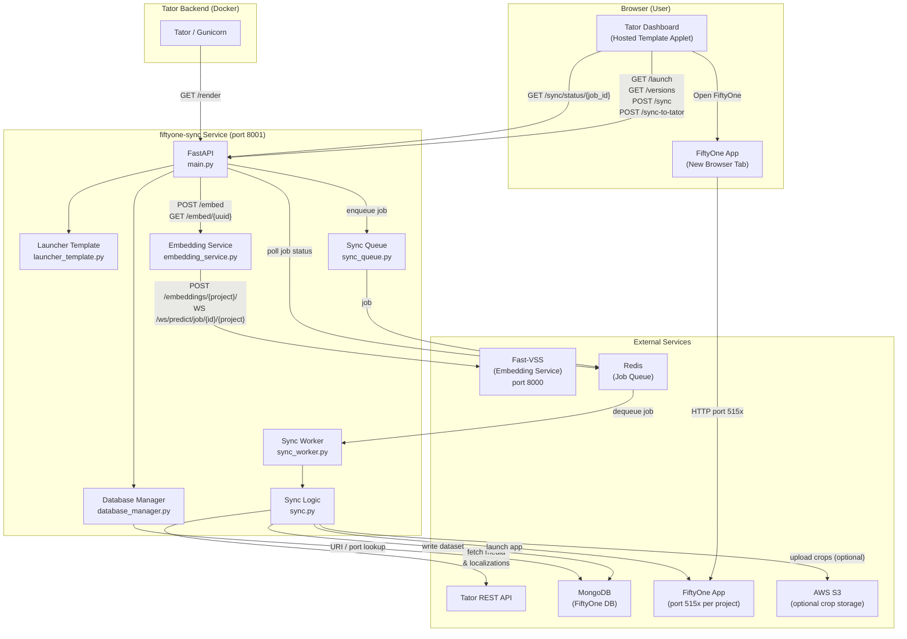

# FiftyOne Sync Service

Backend service to sync data between Tator and Voxel51 for quickly editing localizations
and downstream model iteration.

See https://docs.mbari.org/internal/ai/videos/voxel51demo.gif for demo of the community Voxel51 tool.

Supports both [Voxel51 Community](https://github.com/voxel51/fiftyone) and Voxel51 Enterprise sync.  Syncing is done by version through a simple applet.

### Applet for Tator dashboard to sync to Voxel51. When syncing is done, a clickable link is provided.

### Example Voxel51 embedding/grid view. Samples can be refined by lassoing an embedding cluster, or by filtering onmetadata (e.g. depth, label, confidence):

### Example Voxel51 similarity search view

### FastAPI


## Architecture



## Features

- **Embedding API**: Delegates to Fast-VSS (`http://localhost:8000/embeddings/{project}/`)
  - `POST /embed` - Submit images (multipart/form-data) + project, returns UUID
  - `GET /embed/{uuid}` - Poll for results (job status from Fast-VSS via WebSocket `/ws/predict/job/{job_id}/{project}`)
  - Set `FASTVSS_API_URL` env var to override Fast-VSS base URL

- **Port isolation**: One FiftyOne App instance per Tator project (one port per project)
  - Port = 5151 + (project_id - 1)

- **MongoDB isolation**: One MongoDB (`containers/fiftyone-sync`); per-project DB `fiftyone_project_{id}` (override via `FIFTYONE_DATABASE_NAME` or `database_name` query param on `/launch` and `/sync`).

- **Launcher** (HostedTemplate): `/render` (Open FiftyOne + Sync from Tator), `/launch`, `/sync` + `/sync/status/{job_id}`, `/recompute-crops` (+ status/logs), `/sync-to-tator`, `/versions`. Token entered in applet via **Verify Token**; FiftyOne opens in a new tab (`iframe_host` = app host).

- **Dataset management**: `/datasets` (list), `/dataset-exists`, `/delete-dataset`, `/rename-dataset`. Datasets are named `project_v{version}[_s{section}]_{port}` by default for traceability; `POST /rename-dataset?new_name=...` lets you replace this with a more descriptive name (sanitized to safe characters, max **60** characters). These four endpoints accept the Tator API token either via `Authorization: Token <token>` (or `Bearer <token>`) header, or as a `token` query parameter (the convention used by `/sync`, `/sync-to-tator`, `/recompute-crops`, `/dimreduce`).

- **Sync queue (Redis)**: Background worker: `python -m src.app.sync_worker`. Env: `REDIS_HOST`, `REDIS_PORT`, `REDIS_PASSWORD`, `REDIS_USE_SSL`, or `REDIS_URL`.

## Run (Docker)

The service is intended to be run via the compose stack, which starts MongoDB(community only) and the API:

```bash
# From repo root
docker compose -f containers/fiftyone-sync/compose.yaml up -d
```

API: http://localhost:8001. Optional env: copy `containers/fiftyone-sync/.env.example` to `containers/fiftyone-sync/.env` to set `FASTVSS_API_URL`, `REDIS_HOST`, etc.

## Development

For local iteration (no Docker for the API):

```bash
cd services/fiftyone-sync
export FIFTYONE_DATABASE_URI=mongodb://localhost:27017
uvicorn src.app.main:app --host 0.0.0.0 --port 8001
```

Use a venv and install deps first: `python -m venv .venv && source .venv/bin/activate && pip install -r requirements.txt`. Start MongoDB separately (e.g. `docker compose -f containers/fiftyone-sync/compose.yaml up -d mongo`).

## Documentation

Full setup and API reference (config file, query parameters, embeddings/UMAP/similarity, AWS S3 crop upload, Testing, Hosted Template applet registration, database/port allocation, on-disk data layout, pushing edits back to Tator, standalone embedding API, and utility scripts) has moved to **[docs/USAGE.md](docs/USAGE.md)**.

Quick links:
- [AWS S3 crop upload (Enterprise only)](docs/USAGE.md#aws-s3-crop-image-upload-enterprise-only)
- [Testing](docs/USAGE.md#testing)
- [Hosted Template applet setup](docs/USAGE.md#hosted-template-applet-recommended)
- [Database and port allocation](docs/USAGE.md#database-and-port-allocation)
- [`/sync` API reference (query params, config file, embeddings/UMAP)](docs/USAGE.md#sync-and-fiftyone-dataset)
- [`/sync-to-tator` (push edits back to Tator)](docs/USAGE.md#sync-edits-back-to-tator)
- [Embedding API usage](docs/USAGE.md#embedding-api-usage)
- [Scripts](docs/USAGE.md#scripts)
